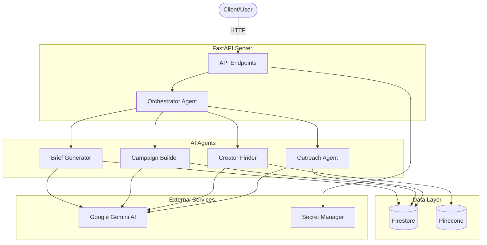

<p align="center">
  
</p>

# Creo Agent API

AI-powered influencer marketing automation platform with intelligent agents for campaign building, creator discovery, and outreach.

## Quick Start

```bash
# Install dependencies
make install

# Start the server
make server
```

Visit http://localhost:8000 to see the API running.

## Features

- 🤖 **AI Agents** - Orchestrator, Campaign Builder, Creator Finder, Outreach, and Brief Generator
- 🔍 **Vector Search** - Semantic search with Pinecone for intelligent retrieval
- 💾 **Firestore Database** - NoSQL storage for conversations, sessions, and campaigns
- 🚀 **Auto-Deploy** - CI/CD with GitHub Actions to Google Cloud Run
- 🔒 **Secure Secrets** - Google Secret Manager for credential management
- 📊 **Agent Evaluation** - Automated testing with LLM judge system

## Documentation

📚 **[View All Documentation](docs/)**

- **[API Documentation](docs/API.md)** - API endpoints and usage examples
- **[Contributing Guide](docs/CONTRIBUTING.md)** - Setup and development workflow
- **[Deployment Guide](docs/DEPLOYMENT.md)** - Deploy to Google Cloud Run
- **[Database Setup](docs/DATABASE.md)** - Firestore and Pinecone configuration
- **[Secrets Management](docs/SECRETS.md)** - Secure credential storage
- **[Release Process](docs/RELEASE.md)** - Creating releases and CI/CD

## Architecture



## Tech Stack

- **Framework**: FastAPI
- **AI**: Google Gemini (ADK)
- **Database**: Firestore (NoSQL) + Pinecone (Vector)
- **Deployment**: Google Cloud Run
- **CI/CD**: GitHub Actions

## Development

```bash
# Run tests
make test

# Lint code
make lint

# Format code
make format

# Run agent evaluation
make judge AGENT=orchestrator-agent

# Test Docker build
make docker-test

# Verify environment variables
make verify-env
```

## Deployment

Deploy with a single command:

```bash
# Tag and push triggers auto-deployment
git tag v1.0.0
git push origin v1.0.0
```

See [docs/DEPLOYMENT.md](docs/DEPLOYMENT.md) for detailed instructions.

## License

MIT License - see LICENSE file for details.

## Support

- 📖 [Documentation](docs/)
- 🐛 [Report Issues](https://github.com/oron-mozes/creo/issues)
- 💬 [Discussions](https://github.com/oron-mozes/creo/discussions)
